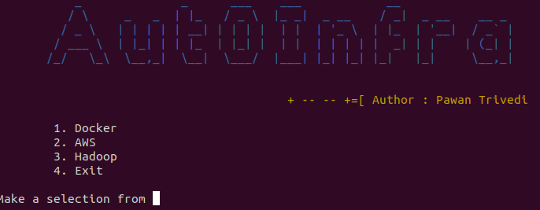
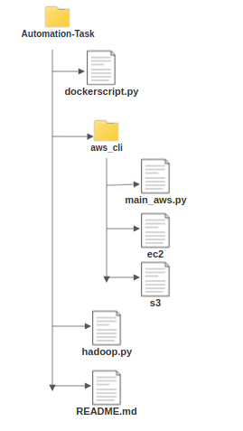

# AutoInfra

Tool to perform your daily IT task and setting up IT infrastructure in one click. Aut0Infra follows the principle of abstraction. So you don't need to worry about if youdo not know the docker commands still you can lauch and work with it and it same goes with Hadoop technology, and you can lauch ec2 instance at large scale in single click. 

## Prerequisites

	Redhat linux
	Python3 

## Installation

	

## Usage

Run main_run.py in python3 env.

## Notes

* Hadoop
		Setting Up Master, Slave and Client nodes at one click.
* Docker
		Running and managing container.
* Aws 
		Managing ec2 and s3 service.

