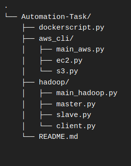

# AutoInfra

Tool to perform your daily IT task and setting up IT infrastructure in one click

## Prerequisites

	Redhat linux
	Python3 

This 

## Installation

## Usage

Run main_run.py in python3 env.

